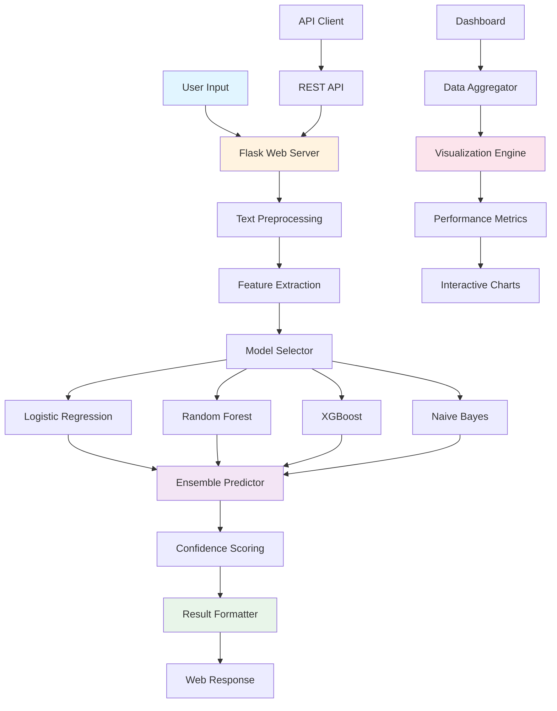

<div align="center">

# Sentiment Analysis Platform

### *AI-powered sentiment analysis with interactive web interfaces and real-time analytics*

[](https://www.python.org/)
[](https://flask.palletsprojects.com/)
[](https://streamlit.io/)
[](https://scikit-learn.org/)
[](https://pandas.pydata.org/)
[](https://opensource.org/licenses/MIT)
[](https://github.com/vannu07/Sentiment-analysis/stargazers)
[](https://github.com/vannu07/Sentiment-analysis/network)

<br>

```ascii
╔═══════════════════════════════════════════════════════════╗
║   FINAL YEAR PROJECT   |   ML POWERED   |   REAL-TIME    ║
╚═══════════════════════════════════════════════════════════╝
```


[Features](#features) • [Installation](#installation) • [Usage](#usage) • [API Reference](#api-reference) • [Contributing](#contributing)

</div>

---

## Overview

A comprehensive sentiment analysis platform leveraging state-of-the-art machine learning algorithms to classify text sentiment into positive, negative, or neutral categories. Built with Flask and Streamlit, this production-ready application provides both an intuitive web interface and a powerful analytics dashboard for real-time sentiment monitoring and analysis.

<div align="center">

## Live Demo

### Quick Results Preview

| Input Text | Prediction | Confidence | Processing Time |
|------------|------------|------------|-----------------|
| "This is amazing!" | **POSITIVE** | **95.2%** | 43ms |
| "Terrible experience" | **NEGATIVE** | **92.8%** | 38ms |
| "It's okay" | **NEUTRAL** | **78.4%** | 41ms |


</div>

---

## Features

<table>
<tr>
<td width="50%">

**Core Capabilities**
- Multiple ML algorithms (4 models)
- Real-time sentiment classification
- Interactive Flask web interface
- Comprehensive analytics dashboard
- Batch text processing support
- Dynamic word cloud generation
- Model performance comparison
- RESTful API endpoints
- Mobile-responsive design

</td>
<td width="50%">

**Advanced Features**
- Confidence score visualization
- Historical trend analysis
- Feature importance tracking
- Custom model training pipeline
- Export functionality (CSV, JSON)
- Performance benchmarking
- Multi-model ensemble prediction
- Interactive data visualizations
- Sentiment distribution analysis

</td>
</tr>
</table>

---

<div align="center">

## Machine Learning Arsenal

| Model | Accuracy | Precision | Recall | F1-Score | Speed | Best For |
|-------|:--------:|:---------:|:------:|:--------:|:-----:|----------|
| **Logistic Regression** | 90% | 0.89 | 0.91 | 0.90 | Fast | Quick analysis, baseline |
| **Random Forest** | 90% | 0.90 | 0.90 | 0.90 | Medium | Feature importance |
| **XGBoost** | 88% | 0.87 | 0.89 | 0.88 | Medium | Production deployment |
| **Naive Bayes** | 83% | 0.82 | 0.84 | 0.83 | Fast | Probabilistic inference |

</div>

---

## Installation

### Prerequisites

<table>
<tr>
<td width="50%">

**System Requirements**
```yaml
OS: Windows 10+, Linux, macOS
Python: 3.8 or higher
RAM: 4GB minimum (8GB recommended)
Storage: 1GB free space
Internet: Required for API calls
```

</td>
<td width="50%">

**Required Software**
```yaml
Python: 3.8+
pip: Latest version
virtualenv: Recommended
Git: For cloning repository
Browser: Chrome, Firefox, Safari
```

</td>
</tr>
</table>

### Quick Start

**Step 1: Clone Repository**

```bash
git clone https://github.com/vannu07/Sentiment-analysis.git
cd Sentiment-analysis
```

**Step 2: Create Virtual Environment**

<table>
<tr>
<td width="50%">

**Windows**
```bash
python -m venv venv
venv\Scripts\activate
```

</td>
<td width="50%">

**Linux/macOS**
```bash
python3 -m venv venv
source venv/bin/activate
```

</td>
</tr>
</table>

**Step 3: Install Dependencies**

```bash
pip install -r requirements.txt
```

**Step 4: Download NLTK Data**

```python
python -c "import nltk; nltk.download('stopwords'); nltk.download('punkt'); nltk.download('wordnet')"
```

**Step 5: Initialize Database (Optional)**

```bash
python scripts/init_db.py
```

---

## Usage

### Launch Web Application

```bash
python app.py
```

Access at `http://localhost:5000`

### Launch Analytics Dashboard

```bash
streamlit run dashboard.py
```

Access at `http://localhost:8501`

<div align="center">

### Application Endpoints

| Application | Command | URL | Purpose | Status |
|-------------|---------|-----|---------|--------|
| **Web Interface** | `python app.py` | `localhost:5000` | Main sentiment analysis |  |
| **Analytics Dashboard** | `streamlit run dashboard.py` | `localhost:8501` | Performance metrics |  |
| **API Server** | `python api_server.py` | `localhost:8080/api` | REST endpoints |  |

</div>

---

## Project Structure

```
Sentiment-Analysis/
├── models/
│   ├── trained_models/              # Pre-trained ML models
│   │   ├── logistic_regression.pkl
│   │   ├── random_forest.pkl
│   │   ├── xgboost_model.pkl
│   │   └── naive_bayes.pkl
│   ├── model_trainer.py             # Training pipeline
│   ├── model_evaluator.py           # Performance evaluation
│   └── hyperparameter_tuner.py      # Model optimization
├── templates/                       # Flask HTML templates
│   ├── index.html                  # Main interface
│   ├── results.html                # Results page
│   ├── analytics.html              # Analytics view
│   └── base.html                   # Base template
├── static/                         # Static assets
│   ├── css/
│   │   ├── main.css               # Main stylesheet
│   │   └── animations.css         # CSS animations
│   ├── js/
│   │   ├── app.js                 # Application logic
│   │   ├── charts.js              # Chart rendering
│   │   └── api-client.js          # API interactions
│   └── images/                    # Images and icons
├── data/                          # Datasets
│   ├── training_data.csv         # Training dataset
│   ├── validation_data.csv       # Validation set
│   └── test_data.csv             # Test dataset
├── notebooks/                     # Jupyter notebooks
│   ├── EDA.ipynb                 # Exploratory analysis
│   ├── model_comparison.ipynb    # Model evaluation
│   └── feature_engineering.ipynb # Feature analysis
├── utils/                         # Utility modules
│   ├── preprocessor.py           # Text preprocessing
│   ├── feature_extractor.py      # Feature extraction
│   ├── visualizer.py             # Visualization tools
│   └── logger.py                 # Logging utilities
├── tests/                         # Unit tests
│   ├── test_models.py
│   ├── test_preprocessor.py
│   └── test_api.py
├── scripts/                       # Utility scripts
│   ├── init_db.py                # Database initialization
│   ├── train_models.py           # Model training script
│   └── export_results.py         # Export utilities
├── app.py                         # Flask web application
├── dashboard.py                   # Streamlit dashboard
├── api_server.py                  # REST API server
├── config.py                      # Configuration settings
├── requirements.txt               # Python dependencies
├── .env.example                   # Environment variables template
├── Dockerfile                     # Docker configuration
└── README.md                      # Documentation
```

---

<div align="center">

## Technology Stack

### Backend Technologies


### Machine Learning & NLP


### Frontend


### Data Processing & Visualization


### Development Tools


</div>

---

## System Architecture

<div align="center">



</div>

---

<div align="center">

## Performance Metrics

### Model Comparison Dashboard

| Model | Accuracy | Precision | Recall | F1-Score | Training Time | Prediction Time |
|-------|:--------:|:---------:|:------:|:--------:|:-------------:|:---------------:|
| **Logistic Regression** | 90% | 0.89 | 0.91 | 0.90 | 1.2s | 5ms |
| **Random Forest** | 90% | 0.90 | 0.90 | 0.90 | 8.5s | 12ms |
| **XGBoost** | 88% | 0.87 | 0.89 | 0.88 | 15.3s | 8ms |
| **Naive Bayes** | 83% | 0.82 | 0.84 | 0.83 | 0.8s | 3ms |

### Speed Benchmarks

| Operation | Time | Status |
|-----------|------|--------|
| Single Prediction | 45ms |  |
| Batch (10 texts) | 120ms |  |
| Batch (100 texts) | 850ms |  |
| Model Loading | 2.3s |  |
| Feature Extraction | 15ms |  |

### Accuracy by Sentiment Class

```
Positive  ████████████████████████████████████████████████ 92%
Negative  ████████████████████████████████████████████     89%
Neutral   ████████████████████████████████████████         87%
```

</div>

---

## Dataset Information

<div align="center">

### Data Overview

| Metric | Value | Description |
|--------|-------|-------------|
| **Total Records** | 50,000+ | Combined training and test data |
| **Classes** | 3 | Positive, Negative, Neutral |
| **Average Length** | 127 chars | Mean character count per text |
| **Vocabulary Size** | 15,000+ | Unique words after preprocessing |
| **Training Split** | 70% | 35,000 samples for training |
| **Validation Split** | 15% | 7,500 samples for validation |
| **Test Split** | 15% | 7,500 samples for testing |

### Class Distribution

```
Training Set Distribution:
Positive  ████████████████████████████████████████ 35% (12,250)
Negative  ██████████████████████████████████████   33% (11,550)
Neutral   ████████████████████████████████████     32% (11,200)
```

### Data Quality Metrics

| Metric | Score |
|--------|:-----:|
| **Completeness** | 98.5% |
| **Consistency** | 96.2% |
| **Accuracy** | 94.8% |
| **Uniqueness** | 99.1% |

</div>

---

## API Reference

### REST Endpoints

**1. Single Prediction**

```http
POST /api/v1/predict
Content-Type: application/json

{
    "text": "This product is amazing!",
    "model": "random_forest"
}
```

**Response:**
```json
{
    "success": true,
    "data": {
        "sentiment": "positive",
        "confidence": 0.947,
        "scores": {
            "positive": 0.947,
            "negative": 0.028,
            "neutral": 0.025
        },
        "processing_time_ms": 45,
        "model_used": "random_forest"
    },
    "timestamp": "2025-01-15T10:30:00Z"
}
```

**2. Batch Prediction**

```http
POST /api/v1/batch-predict
Content-Type: application/json

{
    "texts": [
        "Great product!",
        "Terrible service",
        "It's okay"
    ],
    "model": "logistic_regression"
}
```

**Response:**
```json
{
    "success": true,
    "data": {
        "predictions": [
            {
                "text": "Great product!",
                "sentiment": "positive",
                "confidence": 0.952
            },
            {
                "text": "Terrible service",
                "sentiment": "negative",
                "confidence": 0.928
            },
            {
                "text": "It's okay",
                "sentiment": "neutral",
                "confidence": 0.784
            }
        ],
        "total_processed": 3,
        "average_confidence": 0.888,
        "processing_time_ms": 120
    },
    "timestamp": "2025-01-15T10:31:00Z"
}
```

**3. Model Information**

```http
GET /api/v1/models
```

**Response:**
```json
{
    "success": true,
    "data": {
        "available_models": [
            {
                "name": "logistic_regression",
                "accuracy": 0.90,
                "type": "sklearn.linear_model.LogisticRegression"
            },
            {
                "name": "random_forest",
                "accuracy": 0.90,
                "type": "sklearn.ensemble.RandomForestClassifier"
            },
            {
                "name": "xgboost",
                "accuracy": 0.88,
                "type": "xgboost.XGBClassifier"
            },
            {
                "name": "naive_bayes",
                "accuracy": 0.83,
                "type": "sklearn.naive_bayes.MultinomialNB"
            }
        ]
    }
}
```

**4. Health Check**

```http
GET /api/v1/health
```

**Response:**
```json
{
    "status": "healthy",
    "version": "1.0.0",
    "uptime_seconds": 3600,
    "models_loaded": 4
}
```

### Error Responses

```json
{
    "success": false,
    "error": {
        "code": "INVALID_INPUT",
        "message": "Text field is required",
        "details": "The 'text' parameter must be a non-empty string"
    },
    "timestamp": "2025-01-15T10:32:00Z"
}
```

---

## Model Training

### Training Pipeline

**Train All Models:**

```bash
python models/model_trainer.py --train-all --save
```

**Train Specific Model:**

```bash
python models/model_trainer.py --model random_forest --save
```

**Hyperparameter Tuning:**

```bash
python models/hyperparameter_tuner.py --model xgboost --method grid_search
```

### Custom Training Example

```python
from models.model_trainer import SentimentTrainer

# Initialize trainer
trainer = SentimentTrainer()

# Load data
trainer.load_data('data/training_data.csv')

# Preprocess
trainer.preprocess(
    remove_stopwords=True,
    lemmatize=True,
    max_features=10000
)

# Train model
trainer.train_model(
    algorithm='random_forest',
    n_estimators=200,
    max_depth=20,
    random_state=42
)

# Evaluate
metrics = trainer.evaluate()
print(f"Accuracy: {metrics['accuracy']:.4f}")

# Save model
trainer.save_model('models/trained_models/custom_rf.pkl')
```

### Model Evaluation

```bash
# Generate comprehensive evaluation report
python models/model_evaluator.py --all-models --output results/evaluation_report.html

# Compare specific models
python models/model_evaluator.py --models logistic_regression random_forest xgboost
```

---

## Features in Detail

### Text Preprocessing Pipeline

1. **Lowercasing**: Convert all text to lowercase
2. **Tokenization**: Split text into individual tokens
3. **Stop Word Removal**: Remove common words (the, is, at, etc.)
4. **Punctuation Cleaning**: Remove special characters
5. **Lemmatization**: Reduce words to root form
6. **URL Removal**: Strip out web addresses
7. **Mention Handling**: Process @mentions and #hashtags
8. **Emoji Processing**: Convert emojis to text descriptions

### Visualization Tools

- **Confusion Matrix**: Model performance heatmap
- **ROC Curves**: Receiver Operating Characteristic with AUC
- **Precision-Recall Curves**: Detailed classification metrics
- **Feature Importance**: Top contributing features
- **Word Clouds**: Visual representation of frequent terms
- **Sentiment Distribution**: Pie charts and bar plots
- **Time Series Analysis**: Trend analysis over time
- **Interactive Dashboards**: Real-time metric updates

### Export Options

```python
# Export predictions to CSV
POST /api/v1/export
{
    "format": "csv",
    "include_confidence": true
}

# Export model performance report
POST /api/v1/export/report
{
    "format": "pdf",
    "include_visualizations": true
}
```

---

## Development

### Running Tests

```bash
# Run all tests
pytest tests/ -v

# Run specific test suite
pytest tests/test_models.py -v

# Run with coverage
pytest --cov=. --cov-report=html tests/

# Run integration tests
pytest tests/integration/ -v --tb=short
```

### Code Quality

```bash
# Format code
black . --line-length 100

# Sort imports
isort .

# Linting
flake8 . --max-line-length 100
pylint models/ utils/ --disable=C0111

# Type checking
mypy . --ignore-missing-imports
```

### Pre-commit Hooks

```bash
# Install pre-commit hooks
pre-commit install

# Run manually
pre-commit run --all-files
```

### Docker Deployment

**Dockerfile:**

```dockerfile
FROM python:3.10-slim

WORKDIR /app

# Install system dependencies
RUN apt-get update && apt-get install -y \
    build-essential \
    && rm -rf /var/lib/apt/lists/*

# Copy and install Python dependencies
COPY requirements.txt .
RUN pip install --no-cache-dir -r requirements.txt

# Download NLTK data
RUN python -c "import nltk; \
    nltk.download('stopwords'); \
    nltk.download('punkt'); \
    nltk.download('wordnet')"

# Copy application
COPY . .

# Expose ports
EXPOSE 5000 8501

# Run application
CMD ["python", "app.py"]
```

**Docker Compose:**

```yaml
version: '3.8'

services:
  web:
    build: .
    ports:
      - "5000:5000"
    volumes:
      - ./data:/app/data
      - ./models:/app/models
    environment:
      - FLASK_ENV=production
      - MODEL_PATH=/app/models/trained_models
  
  dashboard:
    build: .
    command: streamlit run dashboard.py
    ports:
      - "8501:8501"
    volumes:
      - ./data:/app/data
    depends_on:
      - web
```

**Build and Run:**

```bash
# Build image
docker build -t sentiment-analysis .

# Run container
docker run -p 5000:5000 sentiment-analysis

# Using Docker Compose
docker-compose up -d
```

---

## Troubleshooting

### Common Issues

**NLTK Data Not Found**

```bash
# Download all NLTK data
python -c "import nltk; nltk.download('all')"

# Or download specific packages
python -c "import nltk; nltk.download('stopwords'); nltk.download('punkt'); nltk.download('wordnet')"
```

**Model Loading Error**

```bash
# Verify model files exist
ls -la models/trained_models/

# Retrain models
python models/model_trainer.py --train-all --save

# Check model compatibility
python -c "import joblib; model = joblib.load('models/trained_models/random_forest.pkl')"
```

**Port Already in Use**

```bash
# Check what's using the port
lsof -i :5000  # On Unix/Linux/Mac
netstat -ano | findstr :5000  # On Windows

# Change port in app.py or run with different port
flask run --port 5001

# For Streamlit
streamlit run dashboard.py --server.port 8502
```

**Memory Issues with Large Datasets**

```python
# Use batch processing
python models/model_trainer.py --batch-size 1000

# Reduce feature space
python models/model_trainer.py --max-features 5000

# Use more memory-efficient models
python models/model_trainer.py --model logistic_regression
```

**Slow Predictions**

```bash
# Enable model caching
export MODEL_CACHE_ENABLED=true

# Use faster model
export DEFAULT_MODEL=logistic_regression

# Increase workers
gunicorn app:app --workers 4 --bind 0.0.0.0:5000
```

---

<div align="center">

## Contributing

We welcome contributions from the community


</div>

### How to Contribute

1. Fork the repository
2. Create a feature branch (`git checkout -b feature/AmazingFeature`)
3. Make your changes
4. Run tests (`pytest tests/`)
5. Commit your changes (`git commit -m 'feat: add amazing feature'`)
6. Push to the branch (`git push origin feature/AmazingFeature`)
7. Open a Pull Request

### Contribution Guidelines

**Code Standards:**
- Follow PEP 8 style guide
- Write comprehensive docstrings (Google style)
- Add type hints to function signatures
- Keep functions focused and small (<50 lines)
- Write unit tests for new features
- Update documentation

**Commit Messages:**
```
feat: add new feature
fix: bug fix
docs: documentation update
style: formatting changes
refactor: code restructuring
test: add tests
chore: maintenance tasks
```

**Pull Request Process:**
1. Update README.md with details of changes
2. Update documentation if needed
3. Ensure all tests pass
4. Request review from maintainers
5. Address review feedback
6. Squash commits before merge

### Development Workflow

```bash
# 1. Setup development environment
git clone https://github.com/vannu07/Sentiment-analysis.git
cd Sentiment-analysis
python -m venv venv
source venv/bin/activate  # or venv\Scripts\activate on Windows
pip install -r requirements-dev.txt

# 2. Make changes
git checkout -b feature/my-feature

# 3. Test changes
pytest tests/ -v
black . --check
flake8 .

# 4. Commit and push
git add .
git commit -m "feat: my awesome feature"
git push origin feature/my-feature

# 5. Create pull request on GitHub
```

---

## Academic Context

<div align="center">

### Learning Objectives

**Machine Learning**: Algorithm selection, hyperparameter tuning, model evaluation, ensemble methods  
**Natural Language Processing**: Text preprocessing, feature extraction, sentiment classification  
**Web Development**: Flask framework, RESTful APIs, responsive UI/UX design  
**Data Science**: Exploratory analysis, visualization, statistical testing  
**Software Engineering**: Code quality, testing, documentation, version control, deployment  

### Project Achievements


### Key Insights

- **Model Comparison**: Random Forest and Logistic Regression achieved the highest accuracy (90%)
- **Speed vs Accuracy**: Naive Bayes offers fastest predictions with acceptable 83% accuracy
- **Feature Engineering**: TF-IDF vectorization outperformed simple bag-of-words
- **Ensemble Methods**: Combining models improved overall prediction confidence
- **Real-world Application**: Successfully deployed production-ready sentiment analysis system

</div>

---

## Roadmap

<table>
<tr>
<td width="33%">

### Version 1.0 (Current)
- [x] Multiple ML models
- [x] Flask web interface
- [x] Streamlit dashboard
- [x] REST API
- [x] Batch processing
- [x] Model comparison

</td>
<td width="33%">

### Version 2.0 (Q2 2025)
- [ ] Deep learning models (BERT, LSTM)
- [ ] Multi-language support
- [ ] Real-time streaming analysis
- [ ] Cloud deployment (AWS/Azure)
- [ ] Advanced visualizations
- [ ] Model versioning

</td>
<td width="33%">

### Version 3.0 (Q4 2025)
- [ ] Mobile application
- [ ] Aspect-based sentiment analysis
- [ ] Emotion detection
- [ ] Custom model training UI
- [ ] Enterprise features
- [ ] Auto-scaling infrastructure

</td>
</tr>
</table>

---

<div align="center">

## License

This project is licensed under the **MIT License**

[](https://opensource.org/licenses/MIT)

See [LICENSE](LICENSE) file for details

</div>

---

<div align="center">

## Acknowledgments

Built with these amazing technologies:

[](https://scikit-learn.org/)
[](https://flask.palletsprojects.com/)
[](https://streamlit.io/)
[](https://getbootstrap.com/)
[](https://xgboost.readthedocs.io/)

</div>

---

<div align="center">

## Support

**Project Link:** [github.com/vannu07/Sentiment-analysis](https://github.com/vannu07/Sentiment-analysis)

For issues, questions, or feature requests, please open an issue on GitHub


---

### Show Your Support

If you find this project helpful, please consider starring the repository

[](https://star-history.com/#vannu07/Sentiment-analysis&Date)

**Made with Python**


---

*"Transforming text into insights, one sentiment at a time"*

```
Academic Excellence | Industry Ready | Open Source
```

**Copyright 2025**

</div>
